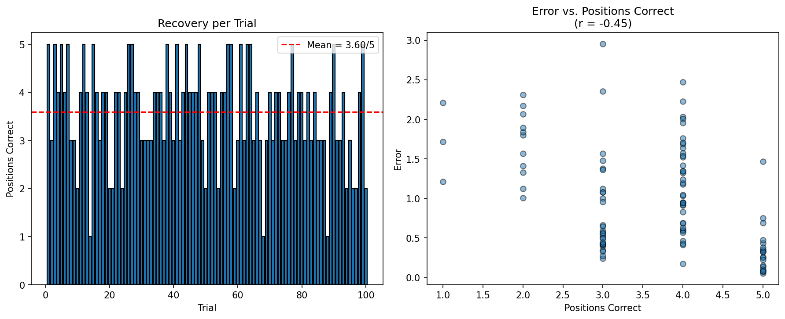

# Sparse Recovery From Scratch

From-scratch implementation of sparse signal recovery algorithms (matching pursuit, LASSO). We explore how a sparse signal can be reconstructed in conditions where there are fewer measurements than unknowns.

## Problem Setup

Given `n` unknowns, of which a number `k` are nonzero, and `m` indirect linear measurements (`m < n`), can we recover the true sparse signal `x_true` using only the measurement matrix `A` and the observed results:

$$y = A x_{true}$$

## Current Status

**Matching pursuit: successfully implemented and working.**

The initial implementation utilized raw, un-normalized dot-product results for both candidate selection and coefficient estimation. As such, there was a bias toward the selection of columns with large magnitudes regardless of true alignment, and incorrectly-scaled coefficients caused the residual to grow instead of shrink across rounds. This led to a significant divergence between the empirical and true sparse signals.

This was fixed by separating the selection functionality into two distinct roles. The latest implementation now uses normalized columns for candidate selection to avoid biases toward large magnitudes of little prominence, while a separate least-squares calculation uses the original un-normalized column to compute the correctly-scaled coefficient stored in `x_hat`.

At `n=50`, `m=20`, `k=5` (measurement-to-sparsity ratio `m/k = 4`), the algorithm achieves partial recovery. Across 100 trials under the latest implementation, the algorithm identified an average of 3.6 out of 5 positions correctly (72.0%), ranging from 1/5 to 5/5 across individual trials (see baseline data below). This appears to reflect a genuine limitation posed by our measurement-to-sparsity ratio, rather than an effect of implementation error.

Compressed sensing theory (the Candès–Tao Restricted Isometry Property) states that reliable recovery generally requires:

$$m = O\left(k \cdot \log\left(\frac{n}{k}\right)\right)$$

As such, we can presume that the number of unknowns is a comparatively weak factor in the success of our recovery, as `n` only grows logarithmically.

Further tests should likely test varying the `m/k` ratio across a range both above and below our current value:

$$\frac{m}{k} = \frac{20}{5} = 4$$

to empirically observe its effects on recovery success and to test the hypothesis that recovery success scales more positively with higher `m/k` ratios.

## Baseline Trials (n=50, m=20, k=5, m/k=4)

An interesting and rather counterintuitive observation here is that mean error of x_hat from x_true does not appear empirically to have a strong negative correlation with the number of positions correct. This is another aspect worth examining in the broader context of determining how recovery success rates scale. 

## Next Steps

- Systematic variation of `m`, `k`, and `n` to empirically test the effect of the measurement-to-sparsity ratio on recovery reliability
- Implementation of LASSO via coordinate descent as a second recovery method
- Comparison of matching pursuit vs. LASSO recovery quality

## Files

- `sparse_recovery.ipynb` — synthetic problem setup and matching pursuit implementation
